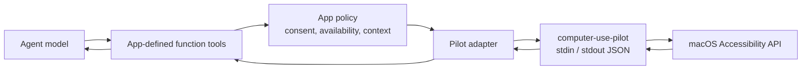

# Integrating with an agentic app

Computer Use Pilot is the native execution layer for an agentic desktop app.
It is not an MCP server and it does not define model tools. Your app defines
function-calling tools for its agent, applies its consent policy, and delegates
each permitted call to the Pilot over newline-delimited JSON.



The app owns everything above the Pilot: model tool schemas, user approval,
tool discovery, payload budgets, history retention, process lifetime, bundle
name, signing, and permissions UI. The Pilot owns macOS Accessibility
inspection and actions.

## Recommended agent tools

Expose a small, direct tool surface. The names below are suggestions; they use
`computer_use_*` to distinguish model-facing functions from the Pilot's native
commands. Each tool maps to one Pilot method.

| Agent function | Pilot `command` | Purpose | Main arguments |
| --- | --- | --- | --- |
| `computer_use_status` | `status` | Check helper availability and Accessibility trust. | none |
| `computer_use_request_accessibility` | `request_accessibility` | Ask macOS for Accessibility trust and optionally open Settings. | `prompt?`, `openSettings?` |
| `computer_use_list_apps` | `list_apps` | List running apps before choosing a target. | none |
| `computer_use_find_apps` | `find_apps` | Find an installed app that is not running. | `query?`, `bundleIdentifier?`, `maxResults?` |
| `computer_use_launch_app` | `launch_app` | Start an app. | `bundleIdentifier?`, `path?`, `activate?` |
| `computer_use_focus_app` | `focus_app` | Bring a running app forward. | `app?`, `bundleIdentifier?`, `pid?` |
| `computer_use_get_app_state` | `get_app_state` | Inspect one app and return compact, line-numbered UI state. | `app?`, `pid?`, `rootElementIndex?`, traversal options |
| `computer_use_click` | `click` | Activate a fresh accessibility element or a coordinate target. | app selector plus `element_index`, or `x` and `y` |
| `computer_use_type_text` | `type_text` | Type literal text into the focused element. | app selector plus `text` |
| `computer_use_set_value` | `set_value` | Set `AXValue` on a normal settable element. | app selector, `element_index`, `value` |
| `computer_use_scroll` | `scroll` | Scroll an element or the current view. | app selector, `element_index?`, direction or deltas |

The function tools should expose only the arguments meaningful to the agent.
They can also accept product-only arguments, such as
`getAppStateAfterMs`; the adapter must remove those before issuing the Pilot
request and can return a follow-up `get_app_state` result to the agent.

## Request and response adapter

For every function call, the adapter generates an ID, maps the tool name to its
Pilot command, and writes exactly one JSON line to stdin:

```json
{
  "id": "a-request-id",
  "command": "get_app_state",
  "arguments": {
    "app": "Safari",
    "maxDepth": 12,
    "maxNodes": 3000,
    "maxTextCharacters": 30000
  }
}
```

The Pilot response repeats `id` and is either successful:

```json
{"id":"a-request-id","ok":true,"result":{"text":"..."}}
```

or a structured failure:

```json
{"id":"a-request-id","ok":false,"error":{"code":"permission_denied","message":"..."}}
```

Preserve correlation by ID when reusing a Pilot process. Map the Pilot's stable
error codes into the agent runtime's normal function-call error shape. Never
write logs or diagnostics to stdout; it is reserved for protocol responses.

## Tool discovery and permission

Do not expose UI inspection or action tools simply because the app is running.

1. Make `computer_use_status` available first.
2. If Accessibility is not trusted, expose
   `computer_use_request_accessibility` and keep inspection/action tools
   unavailable.
3. Once trusted, expose the rest of the functions according to your app's
   user-consent and approval policy.

An app may expose a product-specific bootstrap function that asks the user to
enable Computer Use for the current conversation. That function is app policy,
not a Pilot command; after approval it should call `status` and, only when
requested by the user, `request_accessibility`.

## Agent operating loop

The model should work from fresh accessibility state rather than inferred
screen coordinates:

1. Call `computer_use_status` and establish permission.
2. Use `computer_use_list_apps`, or `computer_use_find_apps` then
   `computer_use_launch_app`, to select the target.
3. Call `computer_use_get_app_state`.
4. Select one line's fresh `element_index` and make exactly one action call.
5. Call `computer_use_get_app_state` again before the next UI decision.

The compact `text` field in app state is the normal model input. It contains
line-numbered elements; use the leading number as `element_index` for `click`,
`set_value`, and element-targeted `scroll`. Treat indexes as invalid after any
action that could change UI structure, focus, or selection.

Use `type_text` for browser address bars, rich web editors, and other controls
where ordinary keyboard typing is expected. Use `set_value` only for ordinary
settable accessibility controls. Keep raw trees, structured element arrays,
and debug fields opt-in because they can consume significant context.

`type_text` requires an explicit app or pid. The Pilot fails closed if that app
does not become active or loses Accessibility focus while text is being posted.

## App responsibilities

| Concern | App adapter | Pilot |
| --- | --- | --- |
| Function schemas and tool names | Defines them | Does not know them |
| User consent and action approval | Enforces product policy | Reports trust and performs requested action |
| Tool availability | Controls model discovery | Does not advertise tools |
| Context budgets and retention | Caps, sanitizes, and expires UI state | Accepts explicit traversal limits |
| Process lifetime | Chooses one-shot or persistent process | Serves requests until stdin closes |
| Packaging and signing | Uses a product-named, signed bundle | Remains product-neutral |

Do not store raw UI snapshots as durable agent memory. They are ephemeral,
potentially sensitive, and their element indexes go stale. Keep only the state
needed for the current tool loop, then require a fresh inspection.
