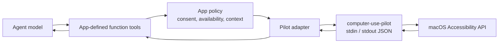

# Integrating with an agentic app

Computer Use Pilot is the native execution layer for an agentic desktop app.
It is not an MCP server and it does not define model tools. Your app defines
function-calling tools for its agent, applies its consent policy, and delegates
each permitted call to the Pilot over newline-delimited JSON.



The app owns everything above the Pilot: model tool schemas, user approval,
tool discovery, payload budgets, history retention, process lifetime, bundle
name, signing, and permissions UI. The Pilot owns macOS Accessibility
inspection and actions.

## Recommended agent tools

Expose a small, direct tool surface. The names below are suggestions; they use
`computer_use_*` to distinguish model-facing functions from the Pilot's native
commands. Each tool maps to one Pilot method.

| Agent function | Pilot `command` | Purpose | Main arguments |
| --- | --- | --- | --- |
| `computer_use_status` | `status` | Check helper availability and Accessibility trust. | none |
| `computer_use_request_accessibility` | `request_accessibility` | Ask macOS for Accessibility trust and optionally open Settings. | `prompt?`, `openSettings?` |
| `computer_use_request_screen_recording` | `request_screen_capture` | Ask macOS for Screen Recording trust. | none |
| `computer_use_screenshot` | `screenshot` | Capture a target window or an entire display as PNG image content. | `scope?`, app selector, `displayId?` |
| `computer_use_list_apps` | `list_apps` | List running apps before choosing a target. | none |
| `computer_use_list_windows` | `list_windows` | List an app's windows and stable window IDs. | app selector |
| `computer_use_find_apps` | `find_apps` | Find an installed app that is not running. | `query?`, `bundleIdentifier?`, `maxResults?` |
| `computer_use_launch_app` | `launch_app` | Start an app. | `bundleIdentifier?`, `path?`, `activate?` |
| `computer_use_focus_app` | `focus_app` | Bring a running app forward. | `app?`, `bundleIdentifier?`, `pid?` |
| `computer_use_get_app_state` | `get_app_state` | Return a screenshot plus full or diffed Accessibility state. | app selector, `disableDiff?`, `includeScreenshot?`, `rootElementIndex?`, traversal options |
| `computer_use_click` | `click` | Activate a fresh accessibility element or a coordinate target. | app selector plus `element_index`, or `x` and `y` |
| `computer_use_dismiss` | `dismiss` | Dismiss an active native menu or popover with `AXCancel`. | app selector and optional accessibility scope or semantic selector |
| `computer_use_press_key` | `press_key` | Press a key or keyboard chord. | app selector, `key` |
| `computer_use_type_text` | `type_text` | Type literal text into the focused element. | app selector plus `text` |
| `computer_use_set_value` | `set_value` | Set `AXValue` on a normal settable element. | app selector, `element_index`, `value` |
| `computer_use_scroll` | `scroll` | Scroll an element or the current view. | app selector, `element_index?`, direction or deltas |
| `computer_use_drag` | `drag` | Drag between foreground screen coordinates. | app selector, `from_x`, `from_y`, `to_x`, `to_y` |
| `computer_use_perform_secondary_action` | `perform_secondary_action` | Invoke an action advertised by an element. | app selector, `element_index`, `action` |
| `computer_use_paste` | `paste` | Paste rich or plain content without taking ownership of the clipboard. | app selector, `text`, `format` |
| `computer_use_select_text` | `select_text` | Select matching text or place the insertion cursor. | app selector, `element_index`, `text`, optional context and selection type |

The function tools should expose only the arguments meaningful to the agent.
Require positive integer `window_id` on window state, window screenshot, focus,
and action tools (including menu actions). Preserve the explicit ID in follow-up
observations. `list_windows`
returns `app`, `success`, and `windows` with `window_id`, `title`, `frame`,
`is_key`, and `is_minimized`; `list_apps` remains unchanged.

State now describes a single selected window and returns `window_id`. IDs live
for the helper session and are not `element_index` or native screenshot IDs.
Omitting an ID returns `invalid_request`; there is no current-window or
remembered-window fallback. After creating/closing windows,
refresh `list_windows` and select explicitly. Handle `window_not_found`,
`window_mismatch`, and `window_focus_failed` by refreshing the target, never by
silently retrying against a different window. A window screenshot requires AX
access and may return `window_capture_ambiguous` if its exact capture cannot be
resolved. Read-only menu-bar observations remain app-wide, require no window ID,
and omit screenshots. Full-screen screenshots and app discovery/launch likewise
need no window ID. Menu actions require and focus their explicit window target.

They can also accept product-only arguments, such as
`getAppStateAfterMs`; the adapter must remove those before issuing the Pilot
request and can return a follow-up `get_app_state` result to the agent.

## Request and response adapter

For every function call, the adapter generates an ID, maps the tool name to its
Pilot command, and writes exactly one JSON line to stdin:

```json
{
  "id": "a-request-id",
  "command": "get_app_state",
  "arguments": {
    "app": "Safari",
    "window_id": 1,
    "maxDepth": 12,
    "maxNodes": 3000,
    "maxTextCharacters": 30000
  }
}
```

The example window ID must come from `list_windows` in the same helper session.

The Pilot response repeats `id` and is either successful:

```json
{"id":"a-request-id","ok":true,"result":{"text":"..."}}
```

or a structured failure:

```json
{"id":"a-request-id","ok":false,"error":{"code":"permission_denied","message":"..."}}
```

Keep one Pilot process alive for the complete Computer Use session; v2 state
revisions and stable element identifiers depend on it. Preserve correlation by
ID and map the Pilot's stable
error codes into the agent runtime's normal function-call error shape. Never
write logs or diagnostics to stdout; it is reserved for protocol responses.

## Tool discovery and permission

Do not expose UI inspection or action tools simply because the app is running.

1. Make `computer_use_status` available first. Its result reports both
   Accessibility and Screen Recording trust.
2. Screenshot tools may be exposed independently when Screen Recording is
   trusted; otherwise offer the app-owned permission flow backed by
   `request_screen_capture`.
3. If Accessibility is not trusted, expose
   `computer_use_request_accessibility` and keep inspection/action tools
   unavailable.
4. Once trusted, expose the rest of the functions according to your app's
   user-consent and approval policy.

An app may expose a product-specific bootstrap function that asks the user to
enable Computer Use for the current conversation. That function is app policy,
not a Pilot command; after approval it should call `status` and, only when
requested by the user, `request_accessibility`.

## Agent operating loop

The model should work from fresh accessibility state rather than inferred
screen coordinates:

1. Call `computer_use_status` and establish permission.
2. Use `computer_use_list_apps` or target an exact installed app directly; the
   Pilot transparently launches an exact non-running match.
3. Call `computer_use_get_app_state`.
4. Prefer an indexed element from the latest observation. Its stable
   `element_index` remains associated with that element across hierarchy diffs.
5. Call `computer_use_get_app_state` again before the next UI decision.

Use the menu-bar accessibility scope to inspect native menus and `dismiss`
before returning to typing or app content. Neither operation moves the hardware
pointer.

The compact `text` field is full on the first observation and a contextual
hierarchy diff thereafter. `stateRevision` and `baseRevision` identify the
relationship. Use the leading stable number as `element_index` for indexed
actions. If the model no longer has the base state, call `get_app_state` with
`disableDiff: true`.

Diffs include unchanged ancestors of added or changed rows with an `=` prefix.
These rows provide structural context, not additional changes. Removed IDs
are summarized separately and are no longer actionable. The helper may return
a full hierarchy when that is smaller than the contextual diff.

When narrowing observations, preserve the inspected group's labels, selected
values, and actionable controls rather than emitting only matching text lines.
The model decides task relevance; the helper preserves AX relationships and
does not infer product cards or other task-specific groups. Use
`rootElementIndex` for a known subtree and opt into `includeElements` or
`includeTree` when structured relationships are needed. An action selector
still targets only its matching element: context must never broaden an action.

When Screen Recording is available, translate `screenshot.image.dataBase64`
into the model runtime's native image-content block and remove the bytes from
structured JSON. When it is unavailable, keep using the returned Accessibility
state and surface `screenshotError` only when vision is actually required.

Use `type_text` for browser address bars, rich web editors, and other controls
where ordinary keyboard typing is expected. Use `set_value` only for ordinary
settable accessibility controls. Keep raw trees, structured element arrays,
and debug fields opt-in because they can consume significant context.

Keyboard commands require an explicit app or pid and post events directly to
that process. The Pilot stops delivery if the process exits; foreground focus
is required only for physical mouse clicks and drags.

## App responsibilities

| Concern | App adapter | Pilot |
| --- | --- | --- |
| Function schemas and tool names | Defines them | Does not know them |
| User consent and action approval | Enforces product policy | Reports trust and performs requested action |
| Tool availability | Controls model discovery | Does not advertise tools |
| Context budgets and retention | Caps, sanitizes, and expires UI state | Accepts explicit traversal limits |
| Process lifetime | Keeps one process per active Computer Use session | Owns stable IDs and diff state until stdin closes |
| Packaging and signing | Uses a product-named, signed bundle | Remains product-neutral |

Do not store raw UI snapshots or screenshots as durable agent memory. They are
ephemeral and potentially sensitive. Keep a reconstructable full baseline plus
the newest diff only for the active tool loop, and force a full observation if
that baseline is no longer present.
